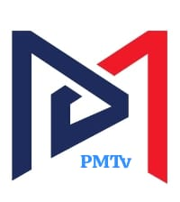

<div align="center">



# 📺 PMTv - Premium Live TV & OTT Platform

**A modern, scalable, and feature-rich Live TV and Media Streaming application built for Android and Android TV, powered by a Realtime Firebase Backend and a React Admin Dashboard.**

[](https://github.com/Bannysukumar/PMTv/stargazers)
[](https://github.com/Bannysukumar/PMTv/network/members)
[](https://github.com/Bannysukumar/PMTv/issues)
[](https://github.com/Bannysukumar/PMTv/pulls)
[](https://opensource.org/licenses/MIT)


⭐ **If you like this project, please give it a star!** ⭐

---

</div>

## 📖 Project Description

**PMTv** is an open source Android app designed to deliver a world-class OTT platform and Live TV experience. This Java Android project is engineered to provide seamless Media Streaming with low latency, supporting both mobile devices and Android TV natively.

What makes PMTv unique is its seamless integration with a **Realtime Firebase Backend** and a beautifully designed **React Admin Dashboard**. The platform synchronizes viewer counts, likes, and comments in real-time, instantly reflecting on both the mobile app and the admin panel. 

**Problems it solves:**
- **Zero Configuration Sync:** No need to build complex WebSockets. Firebase handles all realtime interactions natively.
- **Cross-Platform Administration:** Manage live streams, push notifications, and users directly from the web using the React Admin Dashboard.
- **Audience Engagement:** Live comments and dynamic view counters keep the community engaged during broadcasts.

Whether you are looking to launch your own News App, build a streaming service, or study a production-ready Android Studio Project, PMTv provides the perfect foundation. Developers are highly encouraged to contribute, fork, and build upon this robust architecture!

---

## ✨ Key Features

| 📺 **Viewing Experience** | 🛠️ **System Features** |
| :--- | :--- |
| 📡 **Live TV Streaming:** Low-latency ExoPlayer integration. | ⚡ **Firebase Backend:** Fully powered by Firestore & RTDB. |
| 📺 **Android TV Support:** Native D-Pad optimized UI. | 💻 **Admin Panel:** Full-stack React dashboard. |
| 💬 **Realtime Comments:** Live chat during broadcasts. | 📰 **News System:** Integrated article publishing. |
| 🎨 **Multi Theme Support:** Dynamic dark/light mode. | 🔔 **Notifications:** FCM push notifications built-in. |
| 🖼️ **Picture in Picture (PiP):** Watch while browsing. | 👥 **Community Features:** Interactive forums and posts. |
| 🎵 **Background Playback:** Audio continues playing in bg. | 👤 **Profile System:** User authentication & management. |

---

## 📸 Screenshots

<div align="center">
  <table>
    <tr>
      <td align="center"><b>Splash Screen</b></td>
      <td align="center"><b>Home Screen</b></td>
      <td align="center"><b>Live TV Screen</b></td>
    </tr>
    <tr>
      <td></td>
      <td></td>
      <td></td>
    </tr>
    <tr>
      <td align="center"><b>News Screen</b></td>
      <td align="center"><b>Profile Screen</b></td>
      <td align="center"><b>Admin Dashboard</b></td>
    </tr>
    <tr>
      <td></td>
      <td></td>
      <td></td>
    </tr>
  </table>
  <i>Android TV UI screenshots coming soon...</i>
</div>

---

## 💻 Tech Stack

### Mobile App (Android)
* **Android Studio & Java:** Core application development.
* **ExoPlayer:** High-performance media playback.
* **Material Design 3:** Modern, responsive UI components.

### Web Dashboard (React)
* **React.js:** Component-driven web interface.
* **Material UI (MUI):** Professional design system.
* **Vite:** Next-generation frontend tooling.

### Backend (Firebase)
* **Firestore:** NoSQL database for structured app data (News, Users, Config).
* **Realtime Database (RTDB):** Ephemeral data for live view counts and streaming stats.
* **Firebase Auth & Storage:** Secure user management and media hosting.
* **Firebase Cloud Messaging (FCM):** Push notifications.

---

## 🏗️ Architecture Overview

The PMTv ecosystem utilizes an **Enterprise Architecture** designed for scale:
1. **Decoupled Data Layers:** Static data (like stream titles and URLs) lives in Firestore to reduce costs, while high-frequency data (likes, active viewers) leverages the Realtime Database.
2. **Reactive UI Patterns:** The Android App uses LiveData and Firebase Event Listeners to ensure the UI updates instantly without manual refreshing.
3. **Admin Authority:** The React Admin Dashboard acts as the source of truth, securely pushing updates to the Firebase backend which immediately syncs to all connected Android clients.

---

## 🌟 Why This Project Stands Out

* **Production Ready Design:** This isn't just a prototype. It handles edge cases, lifecycle events, and network failures gracefully.
* **Realtime Synchronization:** See viewer counts tick up and down natively.
* **Android TV Compatibility:** Carefully crafted layouts that work flawlessly with D-Pad remotes on large screens.
* **Scalable Firebase Structure:** Engineered to keep Firebase billing low while supporting thousands of concurrent users.
* **Modern UI/UX:** Stunning, fluid animations with edge-to-edge design principles.

---

## 💼 For Recruiters & Hiring Managers

If you are reviewing this repository for recruitment purposes, this project demonstrates advanced competency in:
* **Full Stack Skills:** Building and connecting a Java Android App with a React Web Dashboard.
* **Firebase Development:** Complex querying, RTDB presence systems, and secure authentication.
* **System Architecture:** Designing scalable, cost-effective NoSQL database structures.
* **UI/UX Design:** Implementing Material 3 guidelines and fluid user experiences.
* **Problem Solving:** Handling asynchronous data streams and complex media player lifecycles.

---

## 🛠️ Installation Guide

### Prerequisites
- Android Studio Ladybug (or newer)
- Node.js (v18+)

### 1. Clone the Repository
```bash
git clone https://github.com/Bannysukumar/PMTv.git
cd PMTv
```

### 2. Android Setup
1. Open the project in Android Studio.
2. Build and run the `:app` module on your emulator or physical device.

### 3. Admin Panel Setup
```bash
cd admin-panel
npm install
npm run dev
```

---

## ⚙️ Firebase Setup Guide

To run your own instance of PMTv, you must connect it to your own Firebase project:
1. Create a project in the [Firebase Console](https://console.firebase.google.com/).
2. Enable **Firestore**, **Realtime Database**, and **Authentication**.
3. Add an Android App to the project and download the `google-services.json` file into the `app/` directory.
4. Add a Web App to the project, copy the config object, and paste it into `admin-panel/src/firebase/config.js`.
5. Ensure your Realtime Database rules are set to allow read/writes.

---

## 🚀 Usage & Admin Panel Guide

1. Deploy or run the Admin Panel locally.
2. Navigate to the **Live Stream Manager**.
3. Update the *Stream Title*, *Description*, and *RTMP URL*. Click **Save Settings**.
4. Open the Android App. The stream will instantly reflect the changes you made in the Admin Dashboard!
5. Watch the dashboard to see live viewer counts update as users join the app.

---

## 📱 Platform Support

### Android TV Support
PMTv includes dedicated layouts for Android TV (`layout-television`). It intelligently detects the device type and adjusts the UI for non-touch, remote-control navigation.

### Mobile Support
Fully optimized for phones and tablets with edge-to-edge layouts, responsive grids, and touch-first interactions.

---

## 🗺️ Roadmap

### Current Features
- ✅ Live RTMP Streaming
- ✅ Realtime Viewers & Engagement
- ✅ React Admin Dashboard
- ✅ News & Community Hub

### Upcoming Features
- ⏳ Multi-Channel Support (Switch between different live broadcasts)
- ⏳ Cast to TV (Chromecast integration)
- ⏳ Push Notification trigger from Admin Panel

### Future Plans
- 🚀 **AI Features:** Automated news summaries and smart content recommendations.
- 🚀 **Monetization Features:** Google AdMob integration and Premium subscription tiers.
- 🚀 **Full OTT Features:** VOD (Video on Demand) library integration.

---

## 🤝 Contributing Guide

We love community contributions! This project is open source and we encourage you to help make it even better.

**How to contribute:**
1. **Fork the Repository** 🍴
2. **Create a Feature Branch** (`git checkout -b feature/AmazingFeature`)
3. **Commit your Changes** (`git commit -m 'Add some AmazingFeature'`)
4. **Push to the Branch** (`git push origin feature/AmazingFeature`)
5. **Submit a Pull Request** 🚀

Please feel free to open an issue to report bugs or suggest improvements. We want this space to be welcoming and collaborative!

---

## 📜 License

Distributed under the MIT License. See `LICENSE` for more information.

---

## 📞 Support & Contact

If you encounter any issues, please check the [Issues](https://github.com/Bannysukumar/PMTv/issues) page or open a new ticket.

**Connect with the Developer:**
💼 **LinkedIn:** [Your LinkedIn Profile]
📧 **Email:** [Your Email Address]
🌐 **Portfolio:** [Your Website]

<div align="center">
  <br/>
  <i>Thank you for checking out PMTv! Don't forget to ⭐ star the repository to show your support!</i>
</div>
